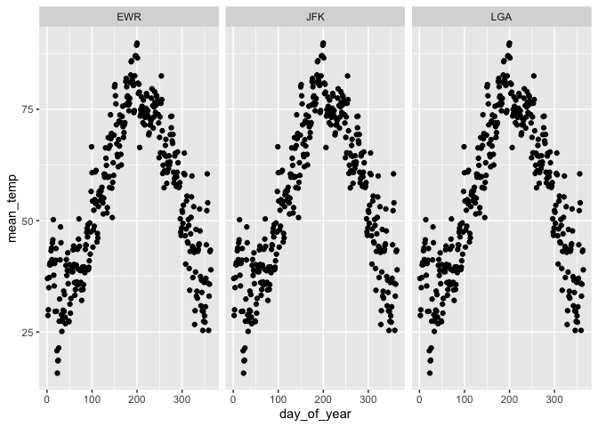

Practice Exam
================
Karl Rohe
2/27/2020

# Practice Exam

This practice exam asks you to do several code wrangling tasks that we
have done in class so far.

Clone this repo into Rstudio and fill in the necessary code. Then,
commit and push to github. Finally, turn in a link to
    canvas.

    ## ── Attaching packages ──────────────────────────────────────────────────────────────────── tidyverse 1.3.0 ──

    ## ✓ ggplot2 3.2.1     ✓ purrr   0.3.3
    ## ✓ tibble  2.1.3     ✓ dplyr   0.8.3
    ## ✓ tidyr   1.0.2     ✓ stringr 1.4.0
    ## ✓ readr   1.3.1     ✓ forcats 0.4.0

    ## ── Conflicts ─────────────────────────────────────────────────────────────────────── tidyverse_conflicts() ──
    ## x dplyr::filter() masks stats::filter()
    ## x dplyr::lag()    masks stats::lag()

Make a plot with three facets, one for each airport in the weather data.
The x-axis should be the day of the year (1:365) and the y-axis should
be the mean temperature recorded on that day, at that airport.

``` r
library(lubridate)
```

    ## 
    ## Attaching package: 'lubridate'

    ## The following object is masked from 'package:base':
    ## 
    ##     date

``` r
weather <- weather %>% mutate(day_of_year = yday(time_hour))

weather$origin <- as.factor(as.character(weather$origin))
weather$day_of_year <- as.numeric(as.character(weather$day_of_year))

mean_temps <- weather %>% 
  group_by(day_of_year) %>% 
  summarize(mean_temp = mean(temp))

weather_short <- weather[,c(1,16 )]

weather_short <- weather_short %>% 
  inner_join(mean_temps, by = "day_of_year") %>% 
  distinct()

weather_short$mean_temp <- as.numeric(as.character(weather_short$mean_temp))

ggplot(weather_short, aes(x=day_of_year, y=mean_temp)) + geom_point() + facet_wrap(~origin)
```

    ## Warning: Removed 3 rows containing missing values (geom_point).

<!-- -->

Make a non-tidy matrix of that data where each row is an airport and
each column is a day of the year.

``` r
non_tidy_weather <- weather_short %>% 
  pivot_wider(names_from = day_of_year, values_from = mean_temp)
```

For each (airport, day) contruct a tidy data set of the airport’s
“performance” as the proportion of flights that departed less than an
hour late.

``` r
# flights <- flights %>% 
#   mutate(day_of_year = yday(time_hour))
# 
# flights$origin <- as.factor(as.character(flights$origin))
# 
# flights %>% 
#   group_by(origin, day_of_year) %>% 
#   mutate(less_than_hour_late <- if(dep_delay)
#   
#   
```

Construct a tidy data set to that give weather summaries for each
(airport, day). Use the total precipitation, minimum visibility, maximum
wind\_gust, and average wind\_speed.

Construct a linear model to predict the performance of each
(airport,day) using the weather summaries and a “fixed effect” for each
airport. Display the summaries.

Repeat the above, but only for EWR. Obviously, exclude the fixed effect
for each airport.
